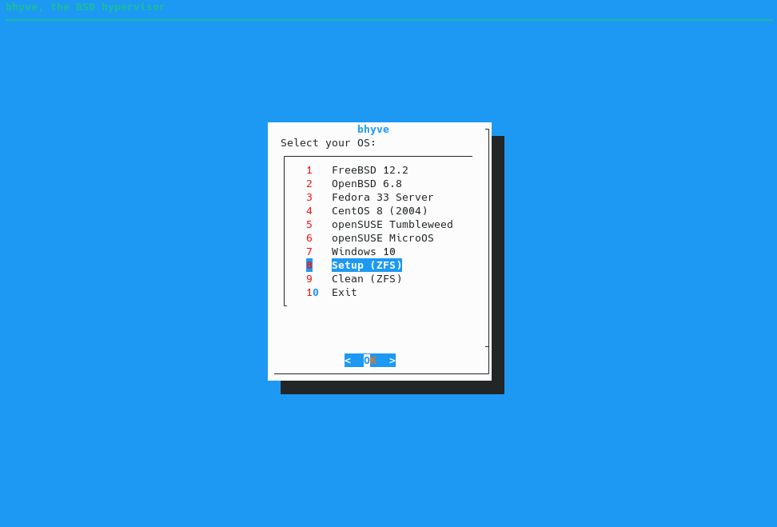

### Installing bhyve script on FreeBSD 12.2 (ZFS only)

Clone the repository:

```
# git clone https://github.com/amressamio/VMs.git
```

Enter the project directory:

```
# cd VMs
```

Change the script permissions:

```
# chmod +x bhyve
```

Run the script:

```
# ./bhyve
```



